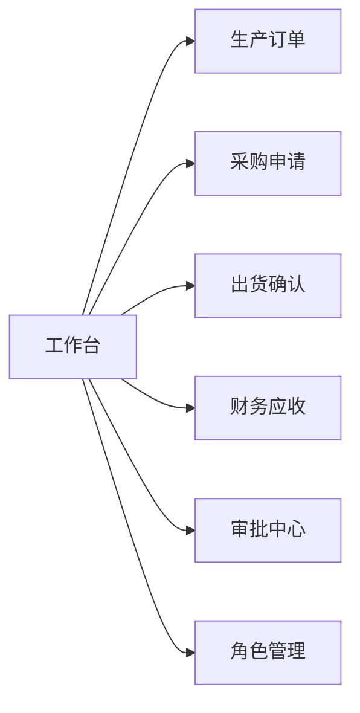
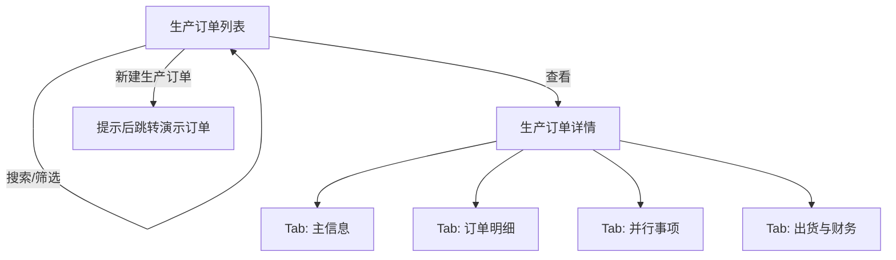
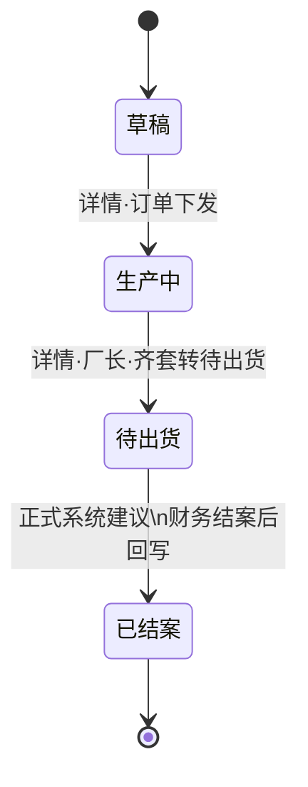
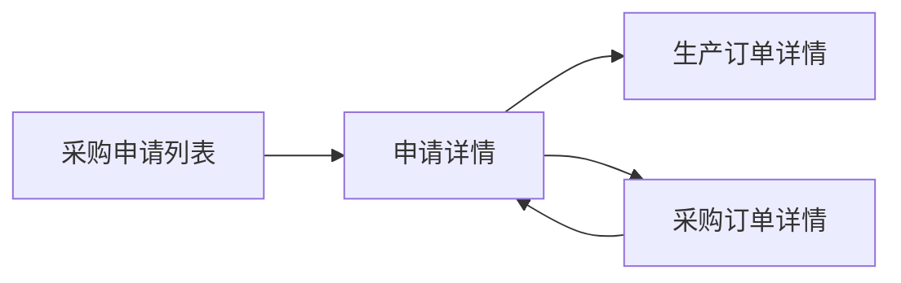
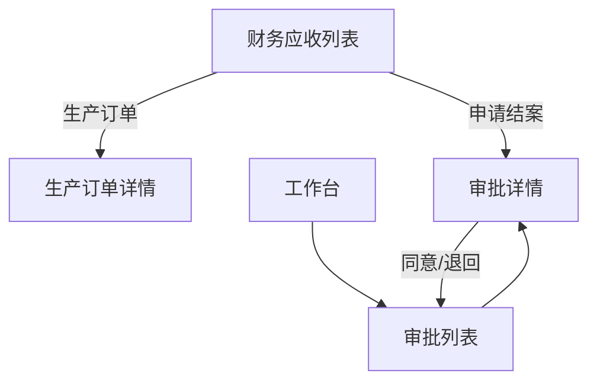
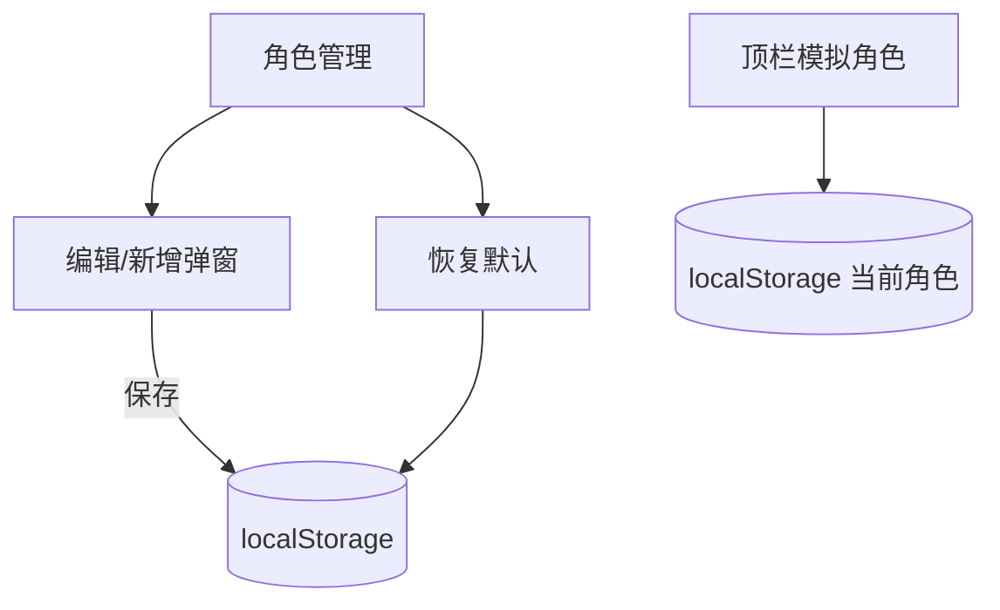

# 内丰 ERP 原型 · 交互流程说明（技术向）

> **给业务同事**：请先阅读 [`软件设计与交互说明（业务版）.md`](./软件设计与交互说明（业务版）.md)，该文档用日常语言介绍「系统是干什么的、要点哪里」。  
> 本文以下内容为 **产品 / 实施 / 开发** 对照用，含路由、存储等技术细节。

本文描述 **HTML/Vue 原型**中的主要用户路径、页面跳转与操作反馈，供评审演示与后续 PRD 对照。技术范围与模块边界见 [`原型说明.md`](./原型说明.md)。

---

## 1. 全局交互

### 1.1 进入系统

1. 访问本地开发地址（`npm run dev` 后终端所示，默认 `http://localhost:5173`）。
2. 路由默认进入 **`/dashboard`（工作台）**。
3. 整体布局为 **左侧导航 + 顶栏 + 主内容区**；主内容区切换路由时带有短暂淡入淡出过渡。

### 1.2 模拟角色（顶栏）

| 操作 | 结果 |
|------|------|
| 在顶栏 **「模拟角色」** 下拉框中选择某一角色 | 当前会话的「登录身份」切换为该角色；选择值写入浏览器 **localStorage**，刷新后仍保留。 |
| 切换后，当前所在页对该角色 **无权限** | 自动 **跳转回工作台**（`/dashboard`），避免停留在不可访问路由。 |

### 1.3 侧栏菜单

| 规则 | 说明 |
|------|------|
| 可见性 | 仅展示当前角色 **有权访问**的菜单项（权限在「角色管理」中配置，见第 7 节）。 |
| **销售 / 车间执行 / 仓库** | 菜单带 **「下期」** 标签；可点击进入 **规划说明页**（`/sales-next`、`/production`、`/warehouse`），无业务表单。 |
| 选中态 | 当前路由对应菜单项高亮（`/production-orders` 子路由统一落在「生产订单」菜单项上）。 |

### 1.4 通用操作反馈（原型）

- 多数 **保存 / 提交 / 审批** 类按钮仅弹出 **Element Plus 消息（Message / MessageBox）**，**不写后端、不改变列表中的模拟数据**（角色相关除外，见第 7 节）。
- **列表数据**来自 `src/mock/data.js` 中的 **`productionOrders` 等**静态数据，刷新页面后恢复为初始演示数据（角色配置受 schema 版本影响，见下）。

### 1.5 角色数据 schema

- `src/stores/roles.js` 中 `SCHEMA_VER` 变更时会 **清空 `nf_erp_proto_roles`** 并写入新默认角色，避免旧版「销售」权限键与路由脱节。

---

## 2. 工作台 → 各模块入口

| 入口 | 交互 | 目标路由 |
|------|------|----------|
| 待我审批表格 · **处理** | 点击 | `/approval/:id` |
| 待我审批 · **进入审批中心** | 点击 | `/approval` |
| 进行中生产订单 · **详情** | 点击 | `/production-orders/:id` |
| 快捷按钮 | 点击 | 对应 `/production-orders`、`/purchase/requests`、`/shipping`、`/finance/receivables` |

**工作台与模拟角色**：顶栏切换角色后，工作台顶部会显示**该岗位的一句话侧重**；**统计卡片**按菜单权限组合（如总经理/管理员看「未下发草稿」、财务看未回款、生产部看并行跟单、车间主任看已下发在制等）；**左侧主区块**在「审批 / 并行跟单 / 采购申请 / 在制订单预览」之间切换；底部生产订单表对非总经理/管理员**不展示草稿行**。路由守卫：直接打开**草稿**详情 URL 且无查看权限时重定向列表。

---

## 3. 生产订单流程（本期无独立销售模块）

### 3.1 列表 → 详情

| 步骤 | 页面 | 操作 | 说明 |
|------|------|------|------|
| 1 | 生产订单列表 | 关键词搜索、状态下拉筛选 | 过滤本地 `productionOrders`。 |
| 2 | 生产订单列表 | **新建生产订单** | 进入 `/production-orders/new`：主信息、**订单明细**（**不含**并行事项表）；校验通过后 `addOrder` 用默认 `tracks` 写入 **localStorage**，跳转详情（**草稿**）；并行内容由**生产部**在详情「并行事项」Tab 维护。 |
| 3 | 生产订单列表 | 行内 **详情** | 进入 `/production-orders/:id`。 |
| 4 | 详情 | 顶部 **返回** | 回到 `/production-orders`。 |
| 5 | 详情 | Tab 切换 | **主信息** / **订单明细** / **并行事项** / **出货与财务**。 |
| 6 | 详情 · 主信息 | **保存主信息（原型提示）** | 仅 Message，不改字段。 |
| 7 | 详情 · 主信息 | **订单下发 / 齐套·转待出货** | **草稿**仅总经理、管理员可见；**订单下发**（`action_mo_issue`）为总经理；**齐套·转待出货**（`action_mo_to_ship`）为**厂长**（是否出货由厂长决定）。 |
| 8 | 详情 · 主信息 | **去采购申请** | 跳转 `/purchase/requests`。 |
| 9 | 详情 · 出货与财务 | **创建出货确认** | 跳转 `/shipping?order=当前生产订单号`，出货页预选。 |
| 10 | 详情 · 出货与财务 | **查看应收列表** | 跳转 `/finance/receivables`。 |
| 11 | 详情 · **并行事项** | 下拉改状态；负责人、计划完成日、说明失焦或变更时保存 | 默认仅 **生产部** 拥有 **`action_parallel_edit`**；调用 `updateTrack` 写 **`nf_erp_proto_production_orders`**。每条线状态 **`未开始` / `进行中` / `完成`**，**独立于**主单 `status`；三条全「完成」**不会**自动触发「齐套·转待出货」。 |

### 3.2 与业务叙事对应关系

- **订单明细**：**单位名称、机型、冷/热（文本）、缝包、台数、打孔、备注**（`stitch` 字段存缝包；旧数据无 `unit` 时加载默认「—」）。
- **并行事项**：机架/抛光、设计/自加工、采购三线并行（无车间工单深度）；**采购为可选**，无外购可不跟采购模块。**状态流转**为每条线各自在 `未开始 → 进行中 → 完成` 间维护（原型允许改回，不强制单向）。
- **生产部判读（业务约定，非系统自动）**：接到/导入同一张生产订单后，由人结合明细与三线说明判断 **是否需要采购**、**是否需要设计确认后再排产或直接排产**；原型不自动分支，结论体现在 **并行卡片说明 + 状态** 及主信息备注（见《业务版》第 1 步下「生产部接到订单后」表）。
- **业务设定**：单据由总经理/授权岗位下达；演示数据 **owner** 为「徐总」等。

### 3.3 生产订单状态机（原型实现与正式系统对照）

**业务状态（与《业务版》文档一致）**：`草稿（未下发，仅总经理/管理员可见）→ 生产中 → 待出货 → 已结案`；**无「待审核」**环节，改为总经理 **订单下发**（本地旧数据中的「执行中」加载时会迁移为「生产中」）。

- **数据源**：`useProductionOrderStore`（`src/stores/productionOrders.js`），初始为 `mock/data.js` 种子，**深度 watch** 持久化到 `localStorage`（`nf_erp_proto_production_orders`），schema 键 `nf_erp_proto_orders_schema`。  
- **未实现自动跳转**：出货确认、审批结案**不**在原型中把订单改为「已结案」；避免与演示用固定审批数据冲突。

---

## 4. 采购流程

**业务说明**：采购与生产订单并行；**无外购需求时可不进入本章节**，订单下发后状态为 **生产中**，可直接跟机架/设计等线。

| 步骤 | 页面 | 操作 | 说明 |
|------|------|------|------|
| 1 | 采购申请列表 | **查看演示申请** | 跳转 `PR-2026-0320-01`。 |
| 2 | 采购申请列表 | 行 **详情** | 进入 `/purchase/requests/:id`。 |
| 3 | 申请详情 | **关联生产订单** 链接 | 进入 `/production-orders/:id`（字段 `productionOrderId`）。 |
| 4 | 申请详情 | **查看关联采购订单** | 跳转 `PO-2026-0321-01`。 |
| 5 | 申请详情 | **提交厂长审批** | 原型按钮，无状态流转。 |
| 6 | 采购订单详情 | 顶部返回 | 回到 `/purchase/requests`。 |
| 7 | 采购订单详情 | **到货登记** 子表 + **登记到货** | 仅 UI 与提示，不持久化新增行。 |

---

## 5. 出货流程

| 步骤 | 页面 | 操作 | 说明 |
|------|------|------|------|
| 1 | 出货确认 | 打开页面 | 若 URL 含 `?order=`，则 **关联生产订单** 下拉预选；否则默认第二条演示单。 |
| 2 | 出货确认 | 填写日期、负责人、台数、物流单号、备注 | 表单可编辑。 |
| 3 | 出货确认 | **确认出货（原型）** | 须 `action_ship_submit`（默认**厂长**）；`Message.success`，不修改已出货台数。 |
| 4 | 出货确认 | **重置** | 清空部分字段，保留默认示例。 |

---

## 6. 财务与结案审批流程

| 步骤 | 页面 | 操作 | 说明 |
|------|------|------|------|
| 1 | 财务应收 | 客户关键词筛选 | 过滤本地行数据。 |
| 2 | 财务应收 | **生产订单** | 进入 `/production-orders/:id`。 |
| 3 | 财务应收 | **申请结案**（未收为 0 等条件） | 跳转 `AP-001`。 |
| 4 | 审批中心 | **处理**（待审批行） | 进入 `/approval/:id`。 |
| 5 | 审批详情 | **同意结案** | 二次确认 → 提示 → 回列表。 |
| 6 | 审批详情 | **退回** | 提示 → 回列表。 |

结案通过后 **不会** 在原型中改写 `productionOrders` 状态。

---

## 7. 角色管理流程

**操作权限**：按钮使用 `can('action_…')` 或 `canProcessApproval(审批行)`；`ACTION_DEFS` 见 `mock/data.js`，在角色弹窗与菜单一并勾选。新建生产订单路由另校验 `action_mo_create`。

| 步骤 | 操作 | 结果 |
|------|------|------|
| 1 | 进入 `/system/roles` | 展示角色表格。 |
| 2 | **新增角色** / **编辑** | 对话框：权限含 `production_order` 等（无 `sales` 键）。 |
| 3 | 勾选 **全部功能（*）** | 与分项互斥。 |
| 4 | **保存** | 写入 Pinia + **localStorage**。 |
| 5 | **删除**（非管理员） | 确认删除；若删当前模拟角色则切回 **admin**。 |
| 6 | **恢复默认** | 内置默认角色（含总经理、厂长、采购、财务、车间主任、**生产部**）。 |
| 7 | 顶栏切换 **模拟角色** | 立即影响菜单与路由守卫。 |

**系统管理员（admin）**：权限固定为 `*`。

---

## 8. 按角色的典型浏览路径（演示建议）

| 角色 | 建议演示路径 |
|------|----------------|
| **系统管理员** | 全菜单 + **角色管理** + 切换模拟身份。 |
| **总经理** | 同上；可操作：**新建单**、**订单下发**、申请结案、**结案审批**与采购申请审批；**无**齐套转待出货、出货确认提交、**无采购菜单**。 |
| **厂长** | 有采购菜单；**转待出货**、**出货提交**；生产订单（无草稿/无新建）、**采购申请审批**；**无**申请结案、结案审批、订单下发。 |
| **车间主任** | **无**新建、无订单下发、无转待出货；可看已下发订单与审批演示列表。 |
| **生产部** | **生产订单**（**并行事项** Tab 可编辑）+ **采购**查看对料；**无**新建/下发/转待出货；**无**审批中心、出货、财务菜单。 |
| **采购** | 仅 **提交采购申请审批** 等；无生产状态按钮。 |
| **财务** | **申请结案**；审批里对结案单**不可**点处理（无 `action_approve_close`）。 |

（默认权限以 `src/stores/roles.js` 为准。）

---

## 9. 异常与边界（原型）

| 场景 | 行为 |
|------|------|
| 不存在的订单/申请/审批 ID | 详情页 **空状态**。 |
| 无权限 URL | **重定向工作台**。 |
| 清除站点本地数据 | 角色随 schema 与存储键恢复；`productionOrders` 等为 `mock/data.js` 初始值。 |

---

## 10. 文档关系

| 文档 | 侧重 |
|------|------|
| [`原型说明.md`](./原型说明.md) | 技术栈、范围、路由表、数据与目录 |
| **本文档** | 用户操作顺序、跳转关系、角色与反馈 |

---

*与原型当前版本一致；路由以 `src/router/index.js` 为准。*
