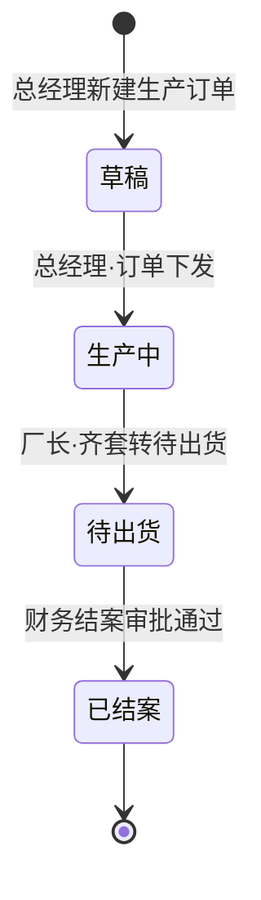
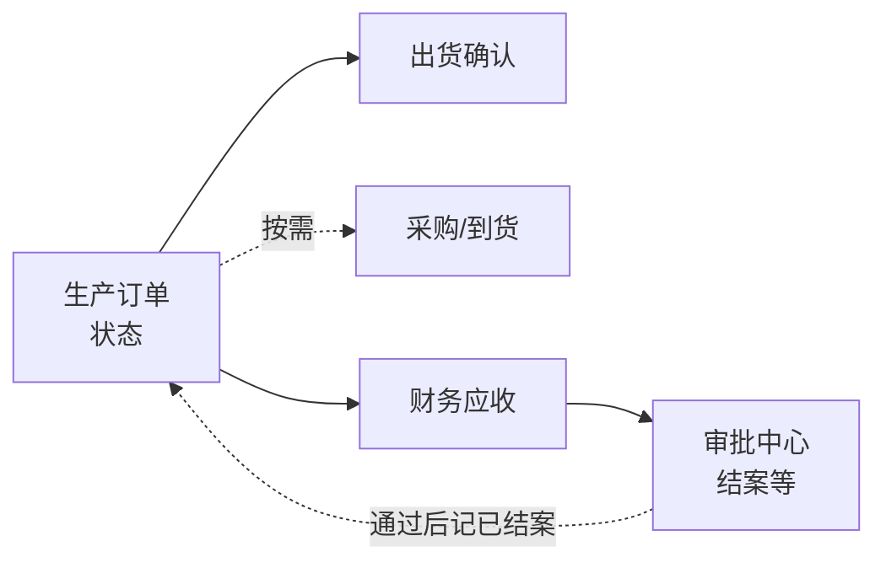

# 内丰 ERP 原型 · 软件设计与交互说明（给业务同事）

这份说明用**平常话**介绍：这套系统是干什么的、屏幕上大概长什么样、您要点哪里，从**总经理下达生产**到**厂长安排出货**、收钱、审批在系统里怎么走。**采购执行**由厂长、采购等角色负责，总经理在原型中**不进入采购菜单**（与常见分工一致）。

> **说明**：当前版本是**可点击的演示原型**，用来和大家对齐想法。部分操作（如**新建生产订单**、详情里**改状态**）会保存在**本浏览器本地**，刷新仍在；**出货确认、结案审批**等仍多为提示，不与状态机自动联动。正式上系统后才会接上真实账套和权限。

---

## 一、这套系统是帮什么忙的？

厂里安排生产后，往往要同时盯几件事：机架与抛光、设计和自己加工、外面买的零件什么时候到。系统希望把**同一张生产订单**上的这些事放在一处看清，并顺着往下做**采购（按需，非必经）**、出货、对账、**审批**，减少电话和微信群来回问。

**与现实的对应关系（本期原型）：**

- **总经理（或您厂实际授权的人）在系统里直接下达的是「生产订单」**，不再单独做一套「销售订单」界面。  
- **销售相关功能本期不做**：菜单里有 **「销售」** 一项，标为 **「下期」**，点进去是规划说明，没有客户、报价、合同等页面。

**这一版原型里还有两类「下期」模块**（菜单里会标「下期」）：

- **车间执行**：细到每天的工单、报工、现场执行——下一期再深入（原「生产」执行层）。  
- **仓库**：库存数量、库位、正式入库出库单——下一期再做。

现在重点让大家看清：**生产订单长什么样、几条线并行怎么跟、采购和出货怎么挂钩、钱收得怎样、谁点个头算结案**。

---

## 二、打开系统后，您先看到什么？

整体就像常见办公软件：

- **左边**：功能菜单（工作台、**生产订单**、采购、出货、财务、审批等；另有标「下期」的**销售**、**车间执行**、**仓库**）。  
- **上面**：当前页面标题；还可以**切换「模拟身份」**（总经理、厂长、采购、财务、车间主任、**生产部**等），看看不同人菜单是否一样——这是给大家演示**权限**用的。  
- **中间**：具体内容，多半是**列表 + 详情**，或者**填表**。

您**不用记网址**，点菜单就会换页面。

---

## 三、一条主线在系统里怎么走？（主流程）

下面用**讲故事**的方式说一遍，方便开会时对着屏幕讲。

### 第 1 步：总经理下达 → 「生产订单」

- 在 **「生产订单」** 列表点 **「新建生产订单」**（仅**总经理**具备新建权限演示），按表单填写客户/项目、交期、至少一行**机型与台数**等，保存后会生成 **「草稿（未下发）」**：此时**仅总经理与系统管理员**能在列表和详情里看到该单，其他岗位**看不到**（避免未正式下达的单子提前扩散）。  
- 总经理在详情主信息中点 **「订单下发」** 后，状态变为 **「生产中」**，全厂有权限的同事才可在列表中看到并跟单。  
- 列表里还能看到：哪天下的单、要哪天交货、一共几台、当前**流转状态**；演示数据里**创建人**多为总经理（如「徐总」）。  
- 点开某一张单，能看到：  
  - **主信息**：客户/项目、交期等；**备注**支持**按时间追加**多条（不覆盖历史），每条可选**普通 / 高优先级**，高优先级在详情里以**红色**突出，便于跟单与开会时一眼看到。  
  - **订单明细**：字段为 **单位名称、机型、冷/热（文本描述）、缝包、台数、打孔、备注**（与线下生产单列对齐；选配与客户强调项写在备注）。  
  - **并行事项**：把厂里常盯的三条线摆成三张卡片——**机架/抛光**、**设计/自加工**、**采购（可选）**（和您手绘流程里「三条线同时走」是一个意思；**无外购时采购线可不跟、不进采购模块**）。每张卡片上有负责人、计划哪天完成、现在什么状态。**由生产部在总经理「订单下发」之后**在详情里填写与修改（新建单页不填并行线，默认「未开始」）；真正下采购单仍在「采购」模块操作。  
  - **出货与财务**：这一单计划发几台、已经发了几台（演示用）、合同大概多少钱、收了多少钱。

**设计意图**：生产订单是**一根主绳**，后面采购、出货、对账都尽量挂在这根绳上，避免「单子对不上号」。以后若上**销售模块**，再讨论销售单据与生产订单如何衔接（见「销售 · 下期」说明页）。

#### 生产部接到订单后：先判读「要不要采购」「要不要设计后再排产」

无论这张单是**总经理在系统里新建**，还是将来由**导入/对接**进入系统，生产部（或厂里指定的生产协调岗位）都建议**以同一张「生产订单」为入口**做判读，避免口头传达和单据脱节。

| 判读问题 | 建议先看哪里 | 结论怎么落在系统里（本期原型） |
|----------|----------------|----------------------------------|
| **要不要采购？** | **订单明细**（机型、选配、备注里是否涉及外购件、专用件）+ **并行事项 · 采购** | 需要买料：采购线进入「进行中」，并到 **「采购」** 里走申请/订单；**本单无采购**时可在采购卡片**说明**里写清「无外购/库存直出」等，状态可按实际标「未开始」或「完成」。系统**不会**自动替您判断要不要采购。 |
| **要不要设计部门参与、出图后再排产？** | **订单明细**（是否新机型、改款、与客户确认的技术点）+ **并行事项 · 设计/自加工** | **需设计确认**：设计线先推进（出图、改模等），再在说明或备注里约定「设计确认后再排产」；**成熟机型、无设计变更**：设计线说明可写「无设计变更，直接排产」，状态按实际维护。原型**不**自动分支「设计后排产 / 直接排产」，由人判读后通过并行线与备注表达。 |
| **机架、抛光、下料何时动？** | 交期、明细台数 + **并行事项 · 机架/抛光** | 与「什么时候算可以排产」对齐；细到日工单、报工仍在 **「车间执行 · 下期」**。 |

**小结**：「要不要采购」「先设计后排产还是直接排产」是**业务判断**；本期用 **订单明细 + 三条并行事项（说明/状态/负责人）** 把结论**显式记下来**，方便采购、设计、车间同看一张单。正式系统若要做**勾选字段或自动规则**（例如按机型字典带出默认路径），可再立项扩展。

### 第 2 步（**可选**）：有外购需求时 → 「采购申请」和「采购订单」

- **本步非必经**：订单下发进入 **「生产中」** 后，若本单**无外购**，可跳过采购菜单，仅通过并行事项等说明「无外购」即可。  
- 需要买料时，走 **「采购」** 里的申请：写要买什么、多少、希望哪天到、倾向哪家供应商。  
- 申请和**生产订单**可以互相对着看（原型里点了能跳过去）。  
- 真正跟供应商下单后，有 **「采购订单」**：单价、金额、交货期。  
- **到货登记**：这一版只做「记一笔哪天到了多少」给大家看流程，**不算正式库存账**，避免和车间执行/仓库一期搅在一起。

### 第 3 步：可以发货了 → 「出货确认」（厂长）

- **是否安排出货、何时出货**，业务上由**厂长**把关；原型里 **「出货确认」提交** 与生产订单上的 **「齐套·转待出货」** 默认仅 **厂长**（及管理员）可操作，**总经理**可打开出货页查看但不做提交（与「总经理不下采购单」类似的分工演示）。  
- 在 **「出货确认」** 里选关联哪张**生产订单**，填出货日期、本批台数、物流单号、备注等。  
- 正式系统里，这里会和仓库、单号、签收等连起来；原型里点确认只会**提示成功**，用来讨论字段够不够。

### 第 4 步：钱收得怎样 → 「财务应收」

- 列表里能看到每张单应收多少、已收多少、还差多少。  
- 款齐了之后，可以走 **「申请结案」**（演示会跳到审批），表示这条业务在财务意义上可以收尾。

### 第 5 步：领导点头 → 「审批中心」

- 比如**结案**、以后还可以扩展**大额采购**等，都会出现在 **「审批中心」**。  
- 打开一条，能看到是谁提交的、关联哪张单，然后**同意**或**退回**。  
- 原型里同意后**不会真的改订单状态**，正式系统里会改。

---

## 四、生产订单有哪些状态？怎么流转？（流程图）

下面这张「状态机」描述的是**业务上**希望怎么管一张生产订单；正式开发时可按角色、权限再细化。当前原型里，**详情页上部分按钮**可以演示从草稿往后推几步；**出货单、结案**与状态的**自动联动**仍属下期完善。

### 4.1 各状态什么意思？

| 状态 | 业务含义（口语） |
|------|------------------|
| **草稿（未下发）** | 总经理刚在系统里建单，内容还可调整；**仅总经理与管理员**可见，其他岗位列表与详情均不可见。 |
| **生产中** | 总经理已点 **「订单下发」**，单子对全厂可见；机架/设计/采购（按需）等几条线按并行事项去跟。 |
| **待出货** | 厂长判断可以发货后（齐套或按约定分批），将单转为待出货；等出货与签收。 |
| **已结案** | 款和对账流程走完了，领导审批结案，这条生产业务在系统里归档。 |

### 4.2 状态怎么往前走？（主流程图）

### 4.3 「并行事项」三条线各自怎么流转？（与主状态的关系）

每张生产订单里有三张卡片：**机架/抛光**、**设计/自加工**、**采购**。**采购**为**可选**跟进的线（无外购可不维护或标「完成」）；机架与设计常跟。**业务上**几条线可同时推进，但在系统里每条线有自己**独立**的小状态，**不会**因为某一条变了就自动改掉整张单的「草稿 / 生产中 / 待出货」等大状态。

**每条并行线允许的状态（原型）：**

| 状态 | 含义（口语） |
|------|----------------|
| **未开始** | 还没动，或刚建单时的默认。 |
| **进行中** | 有人在跟、在加工或在催料。 |
| **完成** | 这一条认为收尾了（例如机架齐、图纸定稿、采购到齐等，由厂里自己约定含义）。 |

**可以怎么变？** 允许在「未开始 → 进行中 → 完成」之间按实际来回调整（例如发现漏项，可从「完成」改回「进行中」）；原型不强制只能单向走。

**谁能在系统里改？** 默认由 **生产部** 拥有 **「操作·并行事项」** 权限，在 **生产订单详情 → 并行事项** 里**创建与维护**每条线的状态、负责人、计划完成日、说明，并**保存在本浏览器**。总经理、厂长、采购、车间主任等**默认只读**该 Tab；若您厂分工不同，可在「角色管理」中把该操作权限勾给其他岗位。**财务**默认只读。

**和主订单状态的关系：** 三条线**全部**显示为「完成」时，**不会**自动把生产订单改成「待出货」；是否点主信息里的 **「齐套·转待出货」** 由**厂长**（原型权限）**手动**操作，体现「是否出货由厂长决定」。这样避免「系统以为齐了、现场还没齐」的误会；正式系统若要做自动提示，可再单独立项。

### 4.4 和出货、财务、审批怎么配合？（示意图）

同一张生产订单，在业务上会同时和「发货」「收钱」「领导审批」打交道，关系可以概括成下面一张图（不表示技术实现细节）：

（角色上：**总经理**走「生产订单 → **财务 / 审批**」盯回款与结案；**出货与齐套转待出货**由**厂长**操作。**采购/到货**由厂长、采购等处理，总经理在系统里可不进采购模块。）

**和原型的对应关系（方便演示时说明）：**

- **新建**：列表 → **新建生产订单**（总经理）→ 填表 → 生成 **草稿**（仅总经理/管理员可见）。  
- **详情里**：总经理点 **订单下发 → 生产中** 后全厂可见；**齐套·转待出货**由**厂长**点；在浏览器里会**真的改掉状态**（本地保存）。  
- **出货确认页**：由**厂长**提交（演示）；原型仍主要是**弹提示**，不自动改「已出货/已结案」。  
- **财务应收 → 申请结案 → 审批中心**：演示审批对话，**不自动**把订单改成「已结案」；正式系统里应对齐状态机。

---

## 五、各岗位大概会点哪里？（方便分工讨论）

| 岗位（举例） | 最常看的功能 | 说明 |
|--------------|--------------|------|
| 老板 / 总经理 | 工作台、**生产订单**、出货（可看）、审批、应收 | **新建**、**订单下发**；草稿仅本人（及管理员）可见；**不出货操作**（齐套转待出货、出货确认提交由厂长）；回款与结案把关；**不看采购菜单**；并行事项**只读**。 |
| 厂长 | 生产订单（并行事项**只读**）、出货、审批 | **是否出货、齐套转待出货、出货确认提交**；**看不到**未下发草稿；并行内容由生产部维护。 |
| **生产部** | 工作台、**生产订单**、**采购**（查看申请/订单以对料） | **创建与维护**并行事项；**无**新建/下发、齐套转待出货等权限；仅在下发后可见该单。 |
| 车间主任 | 生产订单、审批（演示） | 查看**已下发**后的订单；并行事项只读。细工单在「车间执行 · 下期」。 |
| 采购 | 采购申请、采购订单、到货登记；必要时从申请跳进生产订单 | 与生产需求对齐；**看不到**未下发草稿；生产订单内并行事项**只读**。 |
| 财务 | 财务应收、审批（结案）；可跳进生产订单对数 | 对账与结案。 |
| 系统维护（以后） | 角色管理 | 谁能看哪个菜单；正式系统里还会更细。 |

> **说明**：本期**没有「销售」岗位菜单**；若以后单独上销售模块，再增加角色与权限即可。

当前原型用顶上的 **「模拟身份」** 切换角色，菜单会跟着变。

---

## 六、您操作时会遇到哪些反馈？

| 情况 | 您会看到什么 |
|------|----------------|
| **新建生产订单**、详情里**改状态** | 会写入**本浏览器**，列表和详情里的状态会更新；换电脑或清缓存会丢自定义单。 |
| 点「出货确认」「结案同意」等（部分演示） | 多为**弹提示**，不自动改订单状态。 |
| 点了当前身份**不该看**的菜单（若手动输入地址） | 会自动回到**工作台**，表示「没权限」。 |
| 非总经理/管理员打开**草稿**生产订单链接 | 会回到**生产订单列表**，草稿不会出现在您的列表中。 |
| 角色管理里改权限、换模拟身份 | **会记住**（存在本浏览器里）；升级原型时可能**按版本重置**角色或订单演示数据（见技术说明）。 |
| 订单号 | 新建单按规则生成 `MO-年-月日-流水`；与列表中原有演示单格式一致。 |

---

## 七、本期与「下期」怎么分？

| 分类 | 内容 |
|------|------|
| **本期原型重点** | **生产订单**（含**新建**、**状态演示**、并行事项）、采购申请/订单与到货记录（简版）、出货确认（表单）、应收与审批（简版）、角色与菜单权限演示。 |
| **菜单里标「下期」的** | **销售**（客户、报价、合同、销售订单等）、**车间执行**（工单报工等）、**仓库**（库存账务等）——目前为**说明页**。 |
| **正式上系统后还会补的** | 真实登录、与财务软件或税控对接、更细的按钮权限、手机端等——需另立需求。 |

---

## 八、和另外两份文档怎么配合？

| 文档 | 给谁看 |
|------|--------|
| **本文（业务版）** | 老板、厂长、采购、财务、车间等**不写程序**的同事。 |
| `原型说明.md` | 技术同事：技术栈、安装运行、路由与文件结构。 |
| `交互流程说明.md` | 产品、实施、开发：更细的页面跳转（偏技术）。 |

---

如果您希望把某一页（例如「生产订单详情」）做成**一页纸配图说明**（打印给客户），可以说一下页面名称，我可以按同样口吻再拆一版「单页说明」。
